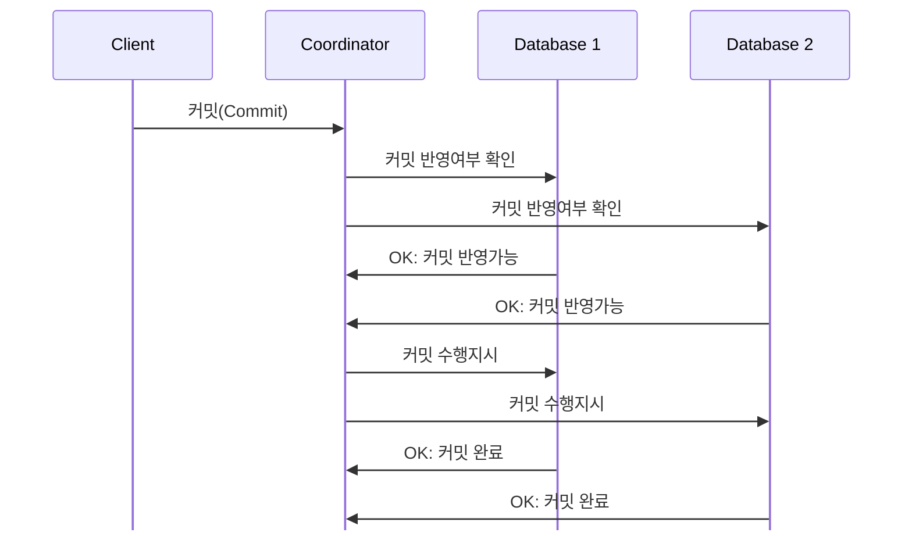

# Two-Phase-Commit(2PC)

## 목차
1. [프로젝트 소개](#프로젝트-소개)
2. [프로젝트 구성](#프로젝트-구성)
3. [프로젝트 설정](#프로젝트-설정)
   - [Java](#java)
   - [Database](#database)
4. [프로젝트 실행](#프로젝트-실행)

## 프로젝트 소개
분산된 데이터베이스의 트랜잭션을 `XA Transaction` 적용을 통해, `2PC`를 활성화여
트랜잭션의 흐름을 하나로 묶고, 2개의 단계에 걸쳐 트랜잭션을 처리하는 기술을 적용해보는 프로젝트입니다.

> `2PC(Two Phase Commit)`이란, 2개 이상의 서로 다른 네트워크 상에서 이루어지는 시스템간의
트랜잭션의 흐름을 하나의 운용 단위로 묶어 처리하는 기술(또는 알고리즘)을 말합니다.

분산된 시스템이 하나의 프로세스를 처리하는 도중, 일부 시스템의 장애나 실패로 인해 진행 중이던
프로세스가 실패가 된다면 모든 시스템에서는 일괄적으로 실패 처리를 해야합니다.

그러나, 일부 시스템에서 성공으로 처리하게 된다면 데이터의 차이가 발생하여 금융이나 배달
서비스 업계에서는 심각한 문제가 발생할 수 있습니다.

`2PC`는 어떻게 이를 처리하는지 확인해보겠습니다.

1. `Coordinator(통합 트랜잭션 관리자)`가 `클라이언트`로부터 `커밋` 요청을 받습니다.
2. ***[1단계]*** `Coordinator`가 모든 데이터베이스에게 `커밋`을 반영할 수 있는지 확인합니다.
   - `Database 1`과 `Database 2`는 작업 모두 완료될 때까지 데이터에 `락(lock)`을 겁니다.
3. `Database 1`과 `Database 2`가 각각 반영 여부에 따라 응답을 합니다.
   - 만약, `커밋`을 반영할 수 없다면 `Coordinator`에게 `중단(abort)` 요청을 보냅니다.
   - `Coordinator`는 어떤 데이터베이스 한 곳에서라도 실패하거나 `중단(abort)` 요청을 받으면, 모든
   데이터베이스에게 `중단(abort)` 요청을 보내고 흐름을 종료합니다.  
4. ***[2단계]*** 모든 데이터베이스에서 `커밋` 반영이 가능하다는 요청을 받는다면, `Coordinator`는 모든
데이터베이스에게 `커밋` 요청을 보냅니다.
5. `Database 1`과 `Database 2`는 각각 `커밋`을 수행합니다.
   - 만약, `커밋`이 실패한 데이터베이스는 `Coordinator`에게 '중단(abort)' 요청을 보냅니다.
   - `Coordinator`는 어떤 데이터베이스 한 곳에서라도 실패하거나 `중단(abort)` 요청을 받으면, 모든
     데이터베이스에게 `중단(abort)` 요청을 보내고, 데이터베이스들은 `롤백(rollback)`을 수행합니다.
6. `커밋`이 완료된 데이터베이스들은 완료 응답을 `Coordinator`에게 보냅니다.



이와 같은 두 개의 단계를 `prepare 단계`, `commit 단계`라고 부릅니다.

물론, `2PC`에도 단점이 존재합니다.
1. 트랜잭션이 모두 완료될 때까지, 처리중인 데이터는 `락(lock)`이 걸린다.
2. `Coordinator(통합 트랜잭션 관리자)`가 트랜잭션을 처리하는 도중 종료되거나 응답이 없을 경우,
모든 데이터베이스들은 `Coordinator`를 통해서만 트랜잭션을 종료할 수 있기 때문에 아무것도 하지 못한다.

이 프로젝트에서는 `2PC` 개념을 구현한 `XA` 아키텍처로 [Spring Boot]의 `JTA(Java Transaction API)`를
사용하였고, `Coordinator`로는 [Atomikos]를 이용하였습니다.

데이터베이스는 `MySQL`이며, `MySQL XA` 드라이버를 적용하였습니다.

> 사용중인 데이터베이스에서 `XA` 아키텍처를 지원하는 드라이버 제공해야 사용할 수 있습니다.

## 프로젝트 구성
| 스팩명           | 버전     | 기타       |
|---------------|--------|----------|
| [Java]        | 21.0.6 | Open JDK |
| [Spring Boot] | 3.5.3  |          |
| [MySQL]       | 9.3.0  |          |

## 프로젝트 설정
### Java
컴퓨터에 설치한 [Java]의 위치를 시스템 환경변수로 등록하여, 인식할 수 있도록 합니다.
&nbsp;

`Linux` 또는 `MacOS` 계열의 OS는 `.bashrc`, `.zshrc` 등, 본인의 컴퓨터 `shell`에 맞는 파일에 아래의 내용을 작성합니다. 
```text
export JAVA_HOME={21버전 이상의 자바 설치 경로}
```

작성이 완료되었다면, 이를 시스템에 반영합니다.
```text
# bash shell
source ~/.bashrc

# zsh shell
source ~/.zshrc

# profile 사용
source ~/.profile
```
&nbsp;

`Windows` 계열에서는 다음과 같이 수행합니다.
```text
setx JAVA_HOME "{21버전 이상의 자바 설치 경로}"
```
&nbsp;

만약, [jenv]를 이용하고 있다면 다음과 같이 수행합니다.
```text
jenv local {21버전 이상의 자바 버전}
```

### Database
이 프로젝트에서 사용된 데이터베이스는 [MySQL]이며, [Docker]를 활용하여 [MySQL] 데이터베이스를 구축합니다.
&nbsp;

[Docker]에서 사용할 [MySQL] 최신 이미지를 받습니다.
```text
docker pull mysql
```
&nbsp;

위의 단계를 통해 받은 [MySQL] 이미지로 [Docker] 컨테이너를 생성하기 위해 `compose.yml` 또는 `docker-compose.yml` 파일을 구성합니다.
```yaml
services:
  two-phase-commit-bank:
    container_name: two-phase-commit-bank
    image: ${DOCKER_IMAGE}
    volumes:
      - ${VOLUME_HOME}/two-phase-commit-bank/data:${MYSQL_DATA_DIR}
      - ${VOLUME_HOME}/two-phase-commit-bank/conf.d:${MYSQL_CONF_DIR}
    ports:
      - '13306:3306'
    environment:
      MYSQL_DATABASE: ${MYSQL_DEFAULT_DATABASE}
      MYSQL_ROOT_PASSWORD: ${MYSQL_ROOT_PASSWORD}
  two-phase-commit-store:
    container_name: two-phase-commit-store
    image: ${DOCKER_IMAGE}
    volumes:
      - ${VOLUME_HOME}/two-phase-commit-store/data:${MYSQL_DATA_DIR}
      - ${VOLUME_HOME}/two-phase-commit-store/conf.d:${MYSQL_CONF_DIR}
    ports:
      - '13307:3306'
    environment:
      MYSQL_DATABASE: ${MYSQL_DEFAULT_DATABASE}
      MYSQL_ROOT_PASSWORD: ${MYSQL_ROOT_PASSWORD}
```
&nbsp;

컨테이너에 대한 정보를 구성할 때, 공통적인 요소는 `.env` 파일에서 변수로 선언하여 불러올 수 있도록 합니다.
```text
DOCKER_IMAGE=mysql:latest
MYSQL_CONF_DIR=/etc/mysql/conf.d
MYSQL_DATA_DIR=/var/lib/mysql
MYSQL_ROOT_PASSWORD={MySQL 초기 구성 시, 설정할 root 계정 비밀번호}
VOLUME_HOME={Docker volume과 연결할 폴더의 경로를 작성}
```
&nbsp;

구성이 모두 완료되었다면, `compose.yml` 또는 `docker-compose.yml`에 작성한 컨테이너 정보를 기반으로 컨테이너를 생성합니다.
```text
docker compose up --detach
```
> ⚠️ `.env` 파일은 `compose.yml` 또는 `docker-compose.yml` 파일과 동일한 경로에 있어야 인식됩니다.

## 프로젝트 실행
먼저, 데이터베이스의 트랜잭션에 대한 `2PC` 활성화 여부를 설정해야합니다.

프로젝트 내부의 `src/main/resources`와 `src/test/resources` 폴더(패키지) 아래 `.yml` 파일을 통해 설정할 수 있으며,
별도의 설정이 없을 경우 비활성화(기본값)가 됩니다.

```yaml
# 2PC 활성화
app:
    xa-enabled: true
```
```yaml
# 2PC 비활성화
app:
    xa-enabled: false
```


[Atomikos]: https://www.atomikos.com/Main/WebHome 'Atomikos main page'
[Docker]: https://www.docker.com/ 'Docker main page'
[Java]: https://openjdk.org/ 'Open JDK main page'
[jenv]: https://github.com/jenv/jenv 'jevn main page'
[MySQL]: https://www.mysql.com 'MySQL main page'
[Spring Boot]: https://docs.spring.io/ 'Spring Boot Framework main page'